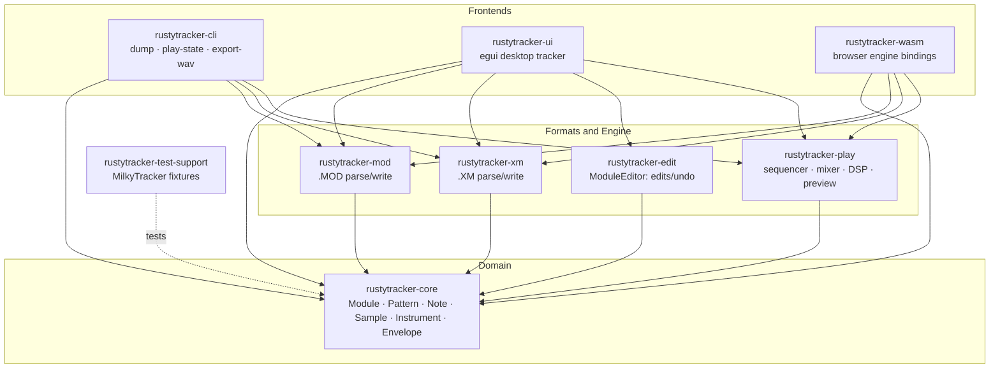
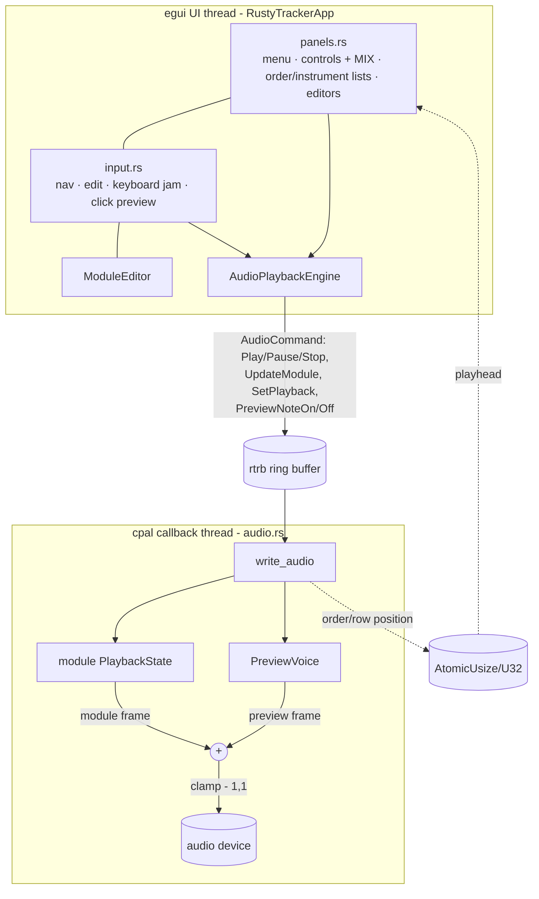
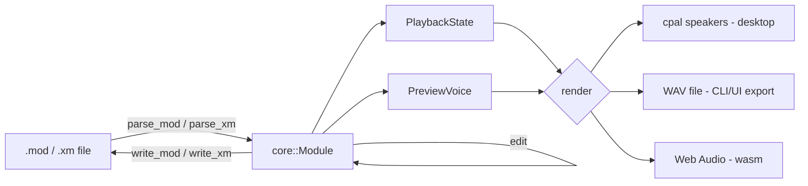

# RustyTracker — Solution Architecture Overview

A Rust workspace re-implementing MilkyTracker's core tracker engine, test-first,
with a desktop UI, a CLI, and a browser (WASM) engine. This document is the
big-picture map: the crates, how they layer, and how audio flows from a module
file to your speakers.

> Diagrams use Mermaid (renders on GitHub). An ASCII version of the signal path
> is included for terminal viewing.

---

## 1. Crate layers

Nine workspace crates in three layers: a shared **domain model**, **format +
engine** crates that operate on it, and **frontends** that drive them.



| Crate | Responsibility |
|-------|----------------|
| `rustytracker-core` | Typed domain model: `Module`, `Pattern`/`PatternCell`, `Note`, `Sample`/`SampleData`, `Instrument`, `Envelope`, mixer-agnostic invariants. |
| `rustytracker-mod` | ProTracker `.MOD` reader/writer. |
| `rustytracker-xm` | FastTracker II `.XM` reader/writer (`model.rs` holds the on-disk shapes). |
| `rustytracker-edit` | `ModuleEditor` — mutation commands (set note/instrument/effect, order/pattern ops). |
| `rustytracker-play` | The audio engine: sequencer, mixer voices, per-mode DSP, render-to-buffer/WAV, and the standalone preview voice. |
| `rustytracker-cli` | Headless tooling: JSON dumps, play-state inspection, `export-wav --mixer …`. |
| `rustytracker-ui` | egui/eframe desktop tracker with a lock-free audio thread. |
| `rustytracker-wasm` | `wasm-bindgen` engine bindings for the browser harness in `web/`. |
| `rustytracker-test-support` | Locates the real MilkyTracker fixture tree (compatibility oracle). |

---

## 2. The playback engine (`rustytracker-play`)

`PlaybackState` couples a **Sequencer** (what to play, when) with a **Mixer**
(turn voices into PCM). They communicate through `SequencerCommand`s, so the
note logic and the DSP stay independently testable.

```mermaid
flowchart LR
    MOD[Module] --> SEQ

    subgraph PlaybackState
        direction TB
        SEQ[Sequencer<br/>PlaybackClock + channels&#91;PlaybackChannelState&#93;<br/>effects.rs · flow.rs · envelope.rs · timing.rs]
        CMD{{SequencerCommand<br/>Trigger / Update / Stop}}
        MIX[Mixer<br/>voices&#91;MixerVoice&#93; + MasterWarmth]
        SEQ -- per tick --> CMD --> MIX
    end

    MIX --> OUT[RawStereoPcmFrame i32,i32]
    OUT --> WAV[render_to_wav]
    OUT --> BUF[render_raw_stereo_frame<br/>for live audio]
```



### Per-frame mixer signal path

For each output frame the mixer walks its active voices, resamples each at its
pitch, applies gain/pan, sums, then (for RustySynth) colors the master bus:

```
 voice.period ──▶ period_to_frequency(table, mixer_mode) ──▶ step = freq / sample_rate
                                                                  │
 sample.data ─────────────▶ get_sample_value(frame, fraction, mixer_mode)
                                  │   ├─ Stepped : nearest sample          (Amiga / ProTracker)
                                  │   ├─ Linear  : 2-pt interpolation       (HiFi)
                                  │   └─ Cubic   : 4-pt Catmull-Rom         (RustySynth)
                                  ▼
                       × volume × volume-envelope × fadeout      (vol_factor)
                                  ▼
                         pan (panning + panning-envelope)  ──▶  L / R
                                  ▼
                advance_sample_position(step)   (loop-aware: forward / ping-pong)
                                  ▼
            Σ all voices ─▶ (mixed_l, mixed_r)
                                  │
                  if mixer_mode.uses_warmth()  ── RustySynth only ──┐
                                  ▼                                 │
                       MasterWarmth (warmth.rs):                    │
                         soft-clip  tanh(DRIVE·x)                   │
                         then one-pole low-pass (CUTOFF_HZ)         │
                                  ▼                                 │
                         (out_l, out_r) ◀───────────────────────────┘
                                  ▼
                         clamp ▶ i16  ──▶  WAV / audio device
```

### Mixer modes

`PlaybackMixerMode` selects pitch clock, interpolation, and warmth. HiFi is the
default; **HiFi / Amiga / ProTracker are byte-identical to their pre-RustySynth
behavior** — only RustySynth carries the cubic + warmth character.

| Mode | Pitch clock | Interpolation | Warmth | Character |
|------|-------------|---------------|--------|-----------|
| **HiFi** (default) | linear/NTSC base | Linear (2-pt) | — | clean, neutral |
| **RustySynth** | same base as HiFi | **Cubic (4-pt Catmull-Rom)** | **soft-clip → low-pass** | hi-fi + warm, the house sound |
| **Amiga** | PAL | Stepped (nearest) | — | vintage, gritty |
| **ProTracker** | PAL | Stepped (nearest) | — | vintage, gritty |

Selected via CLI `--mixer <hifi\|rustysynth\|amiga\|protracker>`, the desktop
**MIX** combo box, or `PlaybackMixerMode::from_name`.

### Sample preview (`preview.rs`)

`PreviewVoice` is a one-voice `Mixer` + a single `PlaybackChannelState`, used to
audition instruments live without running the whole song. It reuses the exact
mixer DSP, so a preview sounds identical to playback/export for the selected
mode. API: `note_on / note_off / render_stereo_frame / is_active`. Monophonic,
sustain-while-held.

---

## 3. Desktop runtime (`rustytracker-ui`)

The egui UI thread never touches the audio device directly. It pushes commands
over a lock-free `rtrb` ring buffer to a `cpal` callback thread, which mixes the
song's `PlaybackState` with the live `PreviewVoice` and writes to the speakers.



Key property: the module frame and preview frame are **always summed** (preview
is audible even while the song is stopped), and when no preview voice is active
its contribution is exactly `0.0`, keeping module-only output bit-identical.

---

## 4. End-to-end data flow



- **Load:** `.xm` is detected by signature, else `.mod`; both parse into a
  single `core::Module`.
- **Edit:** `ModuleEditor` mutates the `Module`; the UI re-sends it to the audio
  thread on each change.
- **Play / render:** `PlaybackState` (song) and `PreviewVoice` (audition) both
  render through the same mixer; outputs go to cpal (desktop), a WAV buffer
  (`render_to_wav`), or Web Audio (wasm).
- **Save:** the `Module` writes back to `.mod` / `.xm`.

---

## 5. Where the recent work lives

| Feature | Crates / files |
|---------|----------------|
| Selectable mixer profiles | `play/lib.rs` (`PlaybackMixerMode`, `PlaybackSettings`), `cli/lib.rs`, `ui/panels.rs` (MIX), `wasm/lib.rs` |
| RustySynth rebrand | `play/lib.rs` (enum/label/cli_name/from_name) |
| Sample preview (jam + click) | `play/preview.rs`, `ui/audio.rs` (preview commands + mix), `ui/input.rs`, `ui/panels.rs`, `ui/app.rs` |
| RustySynth character | `play/lib.rs` (`Interpolation` + cubic), `play/warmth.rs` (`MasterWarmth`) |

---

## 6. Test ladder

Tests gate behavior (the project is test-first). Roughly bottom-up:

1. **Domain invariants** — `core` typed-model tests.
2. **Format round-trips** — `mod` / `xm` parser↔writer fixtures.
3. **Golden dumps / PCM parity** — compared against the real **MilkyTracker**
   tree (located via `rustytracker-test-support`; these references are
   deliberately *not* rebranded — they are the compatibility oracle).
4. **Engine unit + behavioral** — sequencer/effects/cursor, mixer interpolation
   (cubic vs linear vs stepped), warmth (soft-clip/low-pass), preview voice.
5. **Frontend** — CLI smoke/round-trip; UI logic where unit-testable (egui input
   is verified by build + manual smoke, not unit tests).
