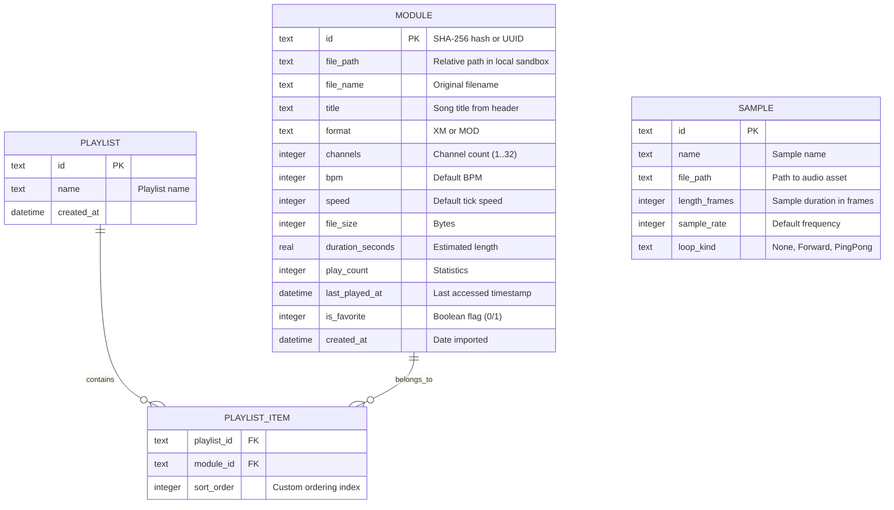

# iOS Database & Platform Architecture for RustyTracker

This document outlines the database design, integration strategy, and audio routing required to bring RustyTracker's core playback engine and module manager to iOS.

---

## 1. Context and Goals

RustyTracker's core is implemented in Rust. The current desktop client uses `rustytracker-ui` (egui), and a web harness runs via WebAssembly. For a native iOS application, we target a SwiftUI interface for modern iOS aesthetics, integrated with the [rustytracker-core](file:///Users/dmytro/Documents/github/rustytracker/crates/rustytracker-core/src/lib.rs) and [rustytracker-play](file:///Users/dmytro/Documents/github/rustytracker/crates/rustytracker-play/src/lib.rs) modules.

### High-Level Architecture
```mermaid
graph TD
    subgraph iOS (SwiftUI & CoreAudio)
        UI[SwiftUI Views]
        Controller[Player Controller / Audio Engine]
        DB[(Local Database / SQLite)]
    end

    subgraph Rust Bridge Layer (UniFFI / staticlib)
        Bridge[Swift/C FFI Bindings]
    end

    subgraph RustyTracker Core Engine (Rust)
        Core[rustytracker-core]
        Play[rustytracker-play]
        XM[rustytracker-xm]
        MOD[rustytracker-mod]
    end

    UI --> Controller
    UI --> DB
    Controller --> Bridge
    Bridge --> Play
    Bridge --> Core
    Bridge --> XM
    Bridge --> MOD
```

---

## 2. Database Design & Schema

To manage a library of music modules (`.xm`, `.mod`), instruments (`.xi`), and audio samples, the iOS client needs a relational database. We propose a lightweight SQLite-based schema to handle tracks, metadata, playlists, and settings.

### Schema ER Diagram



### SQLite Schema Definition

```sql
-- Represents imported tracker modules (XM/MOD)
CREATE TABLE modules (
    id TEXT PRIMARY KEY,
    file_path TEXT NOT NULL,
    file_name TEXT NOT NULL,
    title TEXT NOT NULL,
    format TEXT NOT NULL,
    channels INTEGER NOT NULL,
    bpm INTEGER NOT NULL,
    speed INTEGER NOT NULL,
    file_size INTEGER NOT NULL,
    duration_seconds REAL,
    play_count INTEGER DEFAULT 0,
    last_played_at DATETIME,
    is_favorite INTEGER DEFAULT 0,
    created_at DATETIME DEFAULT CURRENT_TIMESTAMP
);

-- Playlist container
CREATE TABLE playlists (
    id TEXT PRIMARY KEY,
    name TEXT NOT NULL,
    created_at DATETIME DEFAULT CURRENT_TIMESTAMP
);

-- Join table for playlists and modules (supports manual order)
CREATE TABLE playlist_items (
    playlist_id TEXT REFERENCES playlists(id) ON DELETE CASCADE,
    module_id TEXT REFERENCES modules(id) ON DELETE CASCADE,
    sort_order INTEGER NOT NULL,
    PRIMARY KEY (playlist_id, module_id)
);

-- Indexing sample files (for instrument and sample browser)
CREATE TABLE samples (
    id TEXT PRIMARY KEY,
    name TEXT NOT NULL,
    file_path TEXT NOT NULL,
    length_frames INTEGER NOT NULL,
    sample_rate INTEGER NOT NULL,
    loop_kind TEXT NOT NULL,
    created_at DATETIME DEFAULT CURRENT_TIMESTAMP
);

-- Indexes for performance
CREATE INDEX idx_modules_favorite ON modules(is_favorite) WHERE is_favorite = 1;
CREATE INDEX idx_modules_last_played ON modules(last_played_at DESC);
CREATE INDEX idx_playlist_items_order ON playlist_items(playlist_id, sort_order);
```

---

## 3. Database Location: Rust vs. Swift

We have two primary implementation paths for managing this database on iOS.

| Criteria | Option A: Native iOS (SwiftData / GRDB.swift) | Option B: Rust-Side (rusqlite / SQLx) |
| :--- | :--- | :--- |
| **Integration** | Extremely native. Direct SwiftUI bindings (`@Query`, `FetchRequest`). | Requires custom UniFFI mappings for all queries, results, and pagination. |
| **iCloud Syncing** | Simple setup with CloudKit integration built-in. | Manual synchronization logic required. |
| **Cross-Platform** | Relies entirely on iOS-specific frameworks. | Shared logic with desktop (`egui`) and Android (if added). |
| **Performance** | Optimized for iOS system memory cycles and CoreData cache pools. | Rust performance benefits, but bridged crossing FFI costs performance. |
| **UI Updates** | Reactive list updating when data changes. | Must manually trigger notifications or streams from Rust. |

> [!TIP]
> **Recommendation:** Use **GRDB.swift** (or SwiftData) on the iOS side. Swift should request module structure metadata from Rust via the FFI during import, but store it natively. This maximizes SwiftUI compatibility, background save behavior, and CloudKit capability.

---

## 4. Swift-Rust FFI Bridging (UniFFI)

To interface Swift and Rust, we should define a type-safe FFI interface using **UniFFI** inside a bridge crate.

### 1. Unified Interface Definition (UDL File)

```rust
// rustytracker.udl
namespace rustytracker {
    [Error]
    interface TrackerError {
        Error(string message);
    };

    dictionary ModuleMetadata {
        string title;
        u16 channels;
        string format;
        u16 bpm;
        u16 speed;
    };

    // Parses metadata from binary bytes (without spawning playback)
    ModuleMetadata parse_metadata([ByRef] sequence<u8> bytes);

    interface Player {
        constructor([ByRef] sequence<u8> bytes);
        
        void render_stereo(u32 sample_rate, [ByRef] sequence<float> out_l, [ByRef] sequence<float> out_r);
        boolean song_ended();
        u32 current_order();
        u16 current_row();
        u16 current_tick();
    };
}
```

### 2. Rust Interface Implementation (`src/lib.rs` in bridge crate)

```rust
use rustytracker_core::Module;
use rustytracker_play::PlaybackState;
use rustytracker_xm::{XM_HEADER_SIGNATURE, XM_HEADER_SIGNATURE_LENGTH};

#[derive(Debug, thiserror::Error)]
pub enum TrackerError {
    #[error("FFI Error: {message}")]
    Error { message: String },
}

pub struct ModuleMetadata {
    pub title: String,
    pub channels: u16,
    pub format: String,
    pub bpm: u16,
    pub speed: u16,
}

pub fn parse_metadata(bytes: &[u8]) -> Result<ModuleMetadata, TrackerError> {
    if bytes.len() >= XM_HEADER_SIGNATURE_LENGTH
        && &bytes[..XM_HEADER_SIGNATURE_LENGTH] == XM_HEADER_SIGNATURE
    {
        let module = rustytracker_xm::parse_xm_module(bytes)
            .map_err(|e| TrackerError::Error { message: format!("{:?}", e) })?;
        Ok(ModuleMetadata {
            title: module.header.title.as_str().to_string(),
            channels: module.header.channel_count,
            format: "XM".to_string(),
            bpm: module.header.bpm,
            speed: module.header.tick_speed,
        })
    } else {
        let module = rustytracker_mod::parse_mod_module(bytes)
            .map_err(|e| TrackerError::Error { message: format!("{:?}", e) })?;
        Ok(ModuleMetadata {
            title: module.header.title.as_str().to_string(),
            channels: module.header.channel_count,
            format: "MOD".to_string(),
            bpm: module.header.bpm,
            speed: module.header.tick_speed,
        })
    }
}

pub struct Player {
    playback: PlaybackState,
    module: Module,
}

impl Player {
    pub fn new(bytes: &[u8]) -> Result<Self, TrackerError> {
        let is_xm = bytes.len() >= XM_HEADER_SIGNATURE_LENGTH
            && &bytes[..XM_HEADER_SIGNATURE_LENGTH] == XM_HEADER_SIGNATURE;
        
        let (module, format) = if is_xm {
            let m = rustytracker_xm::parse_xm_module(bytes)
                .map_err(|e| TrackerError::Error { message: format!("{:?}", e) })?;
            (m, "xm")
        } else {
            let m = rustytracker_mod::parse_mod_module(bytes)
                .map_err(|e| TrackerError::Error { message: format!("{:?}", e) })?;
            (m, "mod")
        };

        let use_pal_clock = format == "mod";
        let playback = PlaybackState::start_with_config(&module, use_pal_clock)
            .map_err(|e| TrackerError::Error { message: format!("{:?}", e) })?;

        Ok(Self { playback, module })
    }

    pub fn render_stereo(&mut self, sample_rate: u32, out_l: &mut [f32], out_r: &mut [f32]) -> Result<(), TrackerError> {
        for i in 0..out_l.len() {
            match self.playback.render_raw_stereo_frame(&self.module, sample_rate) {
                Ok((left_i32, right_i32)) => {
                    out_l[i] = normalize_sample(left_i32);
                    if i < out_r.len() {
                        out_r[i] = normalize_sample(right_i32);
                    }
                }
                Err(_) => {
                    out_l[i..].fill(0.0);
                    if i < out_r.len() {
                        out_r[i..].fill(0.0);
                    }
                    break;
                }
            }
        }
        Ok(())
    }

    pub fn song_ended(&self) -> bool {
        self.playback.song_ended()
    }

    pub fn current_order(&self) -> u32 {
        self.playback.clock().cursor().order_index() as u32
    }

    pub fn current_row(&self) -> u16 {
        self.playback.clock().cursor().row()
    }

    pub fn current_tick(&self) -> u16 {
        self.playback.clock().tick()
    }
}

#[inline(always)]
fn normalize_sample(sample: i32) -> f32 {
    sample.clamp(-32768, 32767) as f32 / 32768.0
}

// Generate the FFI bindings
uniffi::include_scaffolding!("rustytracker");
```

---

## 5. iOS Audio Rendering & Thread Safety

Audio rendering on iOS occurs inside CoreAudio or AVAudioEngine callback threads. These are high-priority, real-time threads. 

> [!CAUTION]
> **Strict Concurrency Rule:** The audio rendering thread must **never** wait on locks, perform file I/O, allocate memory, or access the SQLite database. Doing so leads to priority inversion and audio dropouts (glitches).

### Architecture for Thread Safety
1. **Instantiation:** When a song is chosen, the file is read from the sandbox and the `Player` is initialized in Rust on the background/UI thread.
2. **Transfer:** The native `Player` pointer is transferred to the audio callback via an atomic reference or wrapper actor.
3. **Double Buffering:** The audio thread requests stereo frames from the player. It writes directly to CoreAudio pointers without locking.
4. **State Reporting:** Current row, order, and tick indices are stored in atomic values in Rust or read lock-free, passing them to the UI thread using Swift's `Combine` or `Observation` frameworks at standard frame intervals (e.g., 60 Hz).

### Swift Audio Engine Integration Example

```swift
import AVFoundation

class TrackerAudioEngine: ObservableObject {
    private var audioEngine: AVAudioEngine
    private var sourceNode: AVAudioSourceNode?
    private var player: Player?
    private let sampleRate: Double = 44100.0
    
    @Published var currentOrder: Int = 0
    @Published var currentRow: Int = 0
    @Published var currentTick: Int = 0
    
    init() {
        self.audioEngine = AVAudioEngine()
        setupAudioNode()
    }
    
    func loadModule(from url: URL) {
        do {
            let data = try Data(contentsOf: url)
            // Initialize Rust player safely on main/background thread
            let newPlayer = try Player(bytes: data)
            
            // Swap player safely (ensure thread-safe reference assignment)
            self.player = newPlayer
            
            if !audioEngine.isRunning {
                try audioEngine.start()
            }
        } catch {
            print("Failed to load module: \(error)")
        }
    }
    
    private func setupAudioNode() {
        let format = AVAudioFormat(standardFormatWithSampleRate: sampleRate, channels: 2)!
        
        self.sourceNode = AVAudioSourceNode { [weak self] (isSilence, timestamp, frameCount, audioBufferList) -> OSStatus in
            guard let self = self, let player = self.player else {
                isSilence.initialize(to: true)
                return noErr
            }
            
            let buffers = UnsafeMutableAudioBufferListPointer(audioBufferList)
            let lBuffer = buffers[0].mData!.assumingMemoryBound(to: Float.self)
            let rBuffer = buffers[1].mData!.assumingMemoryBound(to: Float.self)
            
            var left = Array(repeating: Float(0), count: Int(frameCount))
            var right = Array(repeating: Float(0), count: Int(frameCount))
            
            // Call Rust PCM rendering loop
            _ = try? player.renderStereo(sampleRate: u32(self.sampleRate), outL: &left, outR: &right)
            
            for frame in 0..<Int(frameCount) {
                lBuffer[frame] = left[frame]
                rBuffer[frame] = right[frame]
            }
            
            // Safely update metadata readouts outside direct UI interaction
            DispatchQueue.main.async {
                self.currentOrder = Int(player.currentOrder())
                self.currentRow = Int(player.currentRow())
                self.currentTick = Int(player.currentTick())
            }
            
            return noErr
        }
        
        audioEngine.attach(sourceNode!)
        audioEngine.connect(sourceNode!, to: audioEngine.mainMixerNode, format: format)
    }
}
```

---

## 6. Native iOS Features

A complete tracker app on iOS requires integration with native media systems:

1. **Background Audio & Playback Control:**
   Configure the `AVAudioSession` with the `.playback` category to allow audio output in the background. Connect to the `MPRemoteCommandCenter` to allow lock screen operations (Play/Pause/Next/Previous track).
2. **File Sandboxing & Document Importing:**
   Utilize `UIDocumentPickerViewController` to allow users to load files directly from iCloud Drive or their local filesystem into the app's `Documents` sandbox. Once copied, parse metadata in Rust and write it to SwiftData/CoreData.
3. **Now Playing Info:**
   Update `MPNowPlayingInfoCenter.default().nowPlayingInfo` dynamically with the current track title, format, channel count, and elapsed time to keep the iOS lock screen media card updated.
